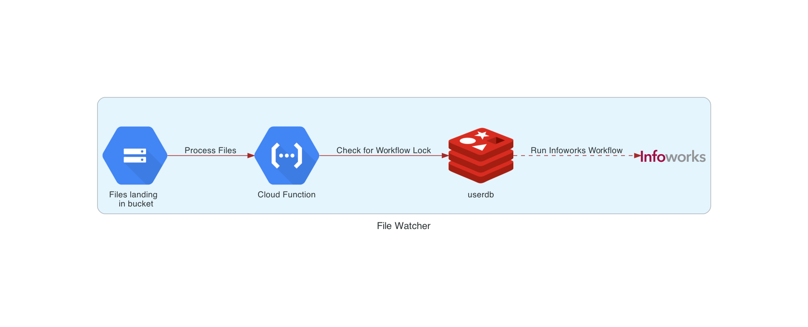

# iwx_filewatcher
This repo consists of code that implements filewatcher process for Infoworks File Based Ingestion Process.
 
Even if multiple files land at the same time in the bucket for single table, the locking mechanism implemented makes sure that 
only 1 File Ingestion Process/Workflow triggers for each table.

# Architecture and Flow Chart

1. Create a Cloud Function which triggers on google.storage.object.finalize event
2. The Cloud function when triggered checks if there is an active lock acquired for the workflow to be triggered.
   If not it *Acquires the lock in Redis* --> *Triggers Infoworks Workflow* --> *Poll for Workflow Run Status* --> Release lock
3. The redis lock_timeout, workflow poll timeout are configurable and can be changed based on requirements